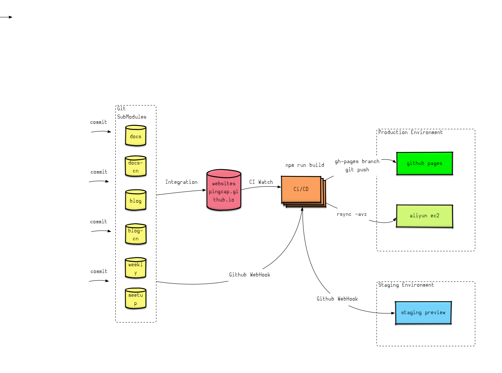
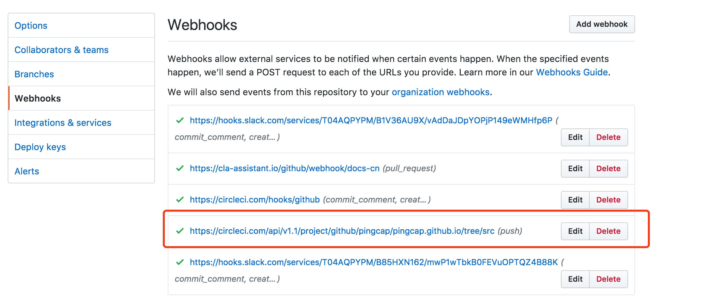
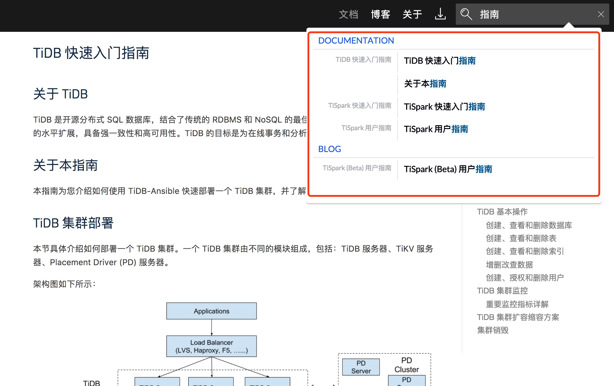
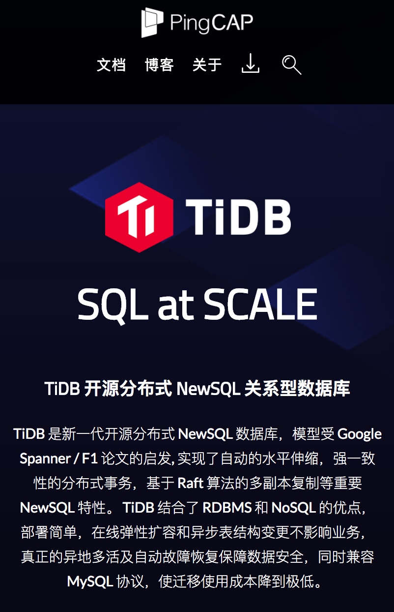
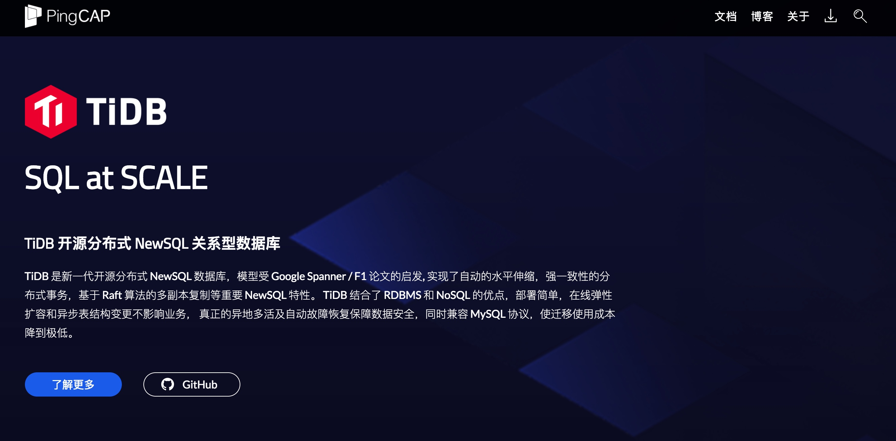

# 分布式数据库 TiDB 企业版选件 - 内容发布工具

## 1 编写目的

编写《多模块持续交付的 Web 全站静态化发布构建工具》的目的是为了介绍通过该软件来
帮助软件用户实施管理多子模块的文档代码仓库全流程 CI/CD 更新发布全站静态过程，以
便读者了解软件的使用范围和使用方法。

## 2 软件特点

构建网站技术层出不穷，但是开发一套合适完善强大的整套框架和流程需要权衡不少考虑点
，通过一系列的开发迭代和改版重构的实践，该套软件的发布构建构建有如下显著特点：

* 全站静态化
* CI/CD 全流程
* 多模块支持

动态化网站可以实现灵活的实时的业务逻辑，如展示实时变化的数据，但对于常见的变化频
率不频繁的文档资讯等类型的网站，可以实现全部静态化，通过扩展和继承模板实现层级复
用，通过完善的模板语言来表现我们的页面。这样可以加上网站访问速度，无需动态生成页
面，免除数据库压力，尽早实施 CDN 加速等。

全流程的 CI/CD，传统网站编写，修改和发布更新等流程较为繁琐，尤其在我们这样的业务
场景下，文档源丰富多样（如 blog，docs ， weekly 等），同时需要区分中英文版本，若
干文章作者每天都可能发布数次，所以需要一套一体化的 pipeline 工作流程来自动触发，
完成各个环境的工作，避免手动操作，节省时间和减少操作可能出现的错误。

多模块支持，在上面提到的文档资讯源头多样，该软件实现了不同的内容源作为单独的 Git
代码仓库，然后作为 SubModule 的形式加入到网站项目，同时在构建部署 CI/CD 上实现支
持。

## 3 功能特点

多模块持续交付的 Web 全站静态化发布构建工具，主要提供如下功能点：

* 文档无侵入性
* 全站静态化
* 全流程 CI/CD 持续集成和交付
* CI/CD 多模块 SubModule 支持
* 生产环境下双部署
* 支持 Staging 环境 CI/CD 支持多版本
* JSON/YAML 配置驱动的页面渲染
* 智能元数据信息解析
* i18n 多语言支持
* 支持自定义排序的全文搜索
* 完善的响应式布局

## 4 运行环境

该套软件可以良好运行在常用的 Linux 发行版本中，经过测试的推荐服务器如下：

| Linux 操作系统平台       |     版本     |
| :----------------------- | :----------: |
| Red Hat Enterprise Linux |  7.3 及以上  |
| CentOS                   |  7.3 及以上  |
| Oracle Enterprise Linux  |  7.3 及以上  |
| Ubuntu LTS               | 14.04 及以上 |

## 5 使用说明

整套软件流程和体系如下：



其中在 `/content` 目录下有我们多子模块的内容和文档，可以作为单独的 Git 代码仓库
独立维护和管理。通过 gitsubmodule 引入和整合，每次构建相关内容通过类似如 `git
submodule update --init --recursive --remote` 来拉取最新子模块内容来作为构建和更
新的基础内容源。用户可以通过修改 .gitmodules 文件来配置新的子模块，来为改静态化
网站发布项目加入特定的内容。

```yml
[submodule "content/docs-cn"]
	path = content/docs-cn
	url = git@github.com:pingcap/docs-cn.git
	branch = master
[submodule "content/docs"]
	path = content/docs
	url = git@github.com:pingcap/docs.git
	branch = master
[submodule "content/blog-cn"]
	path = content/blog-cn
	url = git@github.com:pingcap/blog-cn.git
  branch = master
[submodule "content/meetup"]
	path = content/meetup
	url = https://github.com/pingcap/meetup
	branch = hugo-refactor
[submodule "content/blog"]
	path = content/blog
	url = git@github.com:pingcap/blog.git
	branch = hugo-refactor
[submodule "content/weekly"]
	path = content/weekly
	url = git@github.com:pingcap/weekly.git
	branch = hugo-refactor
```

### Git SubModule WebHook 通知构建

用户可以通过如下界面，在代码仓库的 Webhook 功能入口配置在每一次该代码仓库有代码
更新（new commmit ）的时候通知对应的 CI 服务组件，提示和告知它根据新的更新内容来
构建最新的代码来发布。



### 网站静态化技术

不同的网站有不同的静态化技术，如来实施 HTML 模板化，YAML 格式的 meta 信息解析，
自定义可插拔的构建 pipeline 等。

其中模板技术又包括：

* filter 格式化管道
* 字符串内插
* adhoc expression
* 通用逻辑代码块 if/else/for 等
* 全局和页面级别常量注入
* extend/include 等宏

我们的模板语言示功能例如下：

```html
<body>
  {{ $data_i18_cn := $.Scratch.Get "data_i18_cn" }}

  {{ if $data_i18_cn }}
    {{ partial "header-cn" . }}
  {{ else }}
    {{ partial "header" . }}
  {{ end }}

  {{ block "main" . }}{{ end }}

  <script src="https://download.pingcap.com/js/jquery.min.js"></script>
  {{ block "footJS" . }}{{ end }}

  {{ partial "head/ga" . }}
</body>
```

```html
{{ define "main" }}
<div class="blog">
    <div class="container">
      {{ $posts := where (where .Site.Pages "Section" "blog") ".Params.title" "!=" nil  }}

      {{ partial "list.html" (dict "posts" $posts.ByDate.Reverse "hasMetaData" "true" "hasBrief" "true" "global" .) }}
    </div>
</div>
{{ end }}
```

### 插拔式修改生成页面

对于静态站点构建页面的页面，软件使用者可以通过上面提到的基于定义模板和渲染的默认
pipeline 生成管道，也可以通过自定义 shell 脚本对于生成的页面进行进一步按需修改。
下面演示如何对结果页面的图片链接进行修改为统一的路径规则。

```sh
#!/bin/bash

set -e

replace_dist_html_link() {
  local doc_tmp_path=$1
  local repo_name=$2
  if [ -d "$doc_tmp_path" ];then
    for html in "$doc_tmp_path"/*
    do
      echo "$html"
      # [ "$html" = "." -o "$html" = ".." ] && continue
      if [ -d "$html" ];then
        echo "process sub dir: " $html
        replace_dist_html_link "$html" $repo_name
      fi
      if [[ ! -d "$html" ]] && echo "$html" | grep -E '\.html$' > /dev/null;then
        # using double quote to variable, using [\"] to
        sed -i -r 's;;;g' $html
        # cat _tmp_out1 > $doc_tmp_path/$html
      fi
    done
  fi
}

cn_tmp_docs_path="dist/docs-cn"
en_tmp_docs_path="dist/docs"
replace_dist_html_link "$cn_tmp_docs_path" docs-cn
replace_dist_html_link "$en_tmp_docs_path" docs
```

### CI 持续集成和构建

通过我们的 CI 服务组件，可以实现对于该软件源代码的持续交付和构建功能。它最简单的
流程如下 :

1. 推送代码到 GitHub
2. 触发 CircleCI，开始进行测试 , 然后执行部署命令
3. 服务器接收到代码，触发钩子，执行其他需要执行的项目升级命令

软件提供的基本配置如下，用户可以根据自己的需求进行修改和定制化：

首先看基本的配置信息，来约定使用的版本和构建使用的镜像。

```yml
version: 2
jobs:
  build:
    docker:
      # specify the version you desire here
      - image: circleci/node:8.5
    working_directory: ~/repo

    branches:
      only:
        - src
```

接下来示意的部分是，简单步骤用于静站构建的初始化部分的工作。

```yml
    steps:
      - checkout

      - run: sudo apt-get install -y rsync

      - restore_cache:
          keys:
          - v1-dependencies-{{ checksum "package.json" }}
          - v1-dependencies-

      - run: yarn install

      - save_cache:
          paths:
            - node_modules
          key: v1-dependencies-{{ checksum "package.json" }}

      - run: npm run build

      # notice netlify to deploy preview branch
      # when be triggered by webhook from submodule
      - run: curl -X POST -d '' https://api.netlify.com/build_hooks/<token>
```

最后是把构建生成好的全站静态化内容发布上线。

```yml
      - deploy:
          name: "Publish Website"
          command: |
            if [ "${CIRCLE_BRANCH}" == "src" ];
              then ssh-keyscan "${DEPLOY_HOST}" >> ~/.ssh/known_hosts 2>/dev/null;rsync -avz --delete dist/ "${DEPLOY_USER}@${DEPLOY_HOST}:${DEPLOY_PATH}" || true;
            fi

      - add_ssh_keys:
          fingerprints:
            - "<token>"

      - deploy:
          name: "Publish github.io"
          command: |
            if [ "${CIRCLE_BRANCH}" == "src" ];
              then chmod +x ./scripts/push-gh-pages.sh;sh ./scripts/push-gh-pages.sh;
            fi
```

这里是汇总的流程：

* 提供该 CI 运行的基础环境：node7 和指定工作目录
* 针对 `src` 代码分支有变更时，`clone/checkout` 代码
* 安装基本软件依赖如 rsync
* 安装项目构建特定依赖 `npm install`
* 保存该依赖根据依赖配置做次哈希，存储缓存，便于后续快速载入依赖，加速构建
* 通知测试 staging 环境构建和部署（见下文使用说明）
* 构建静态化网站 `npm run build`
* 添加密钥后，把构建好的内容 rsync 到国内服务器
* 添加密钥后，把构建好的内容同步分布到国外 github.io 多活

### GitHub Pages 静态备份多活

GitHub Pages 是一个静态站点托管服务。 GitHub Pages 设计用于直接从 GitHub 存储库
托管您的个人，组织或项目页面。它可以使用 Jekyll Theme Chooser 在线创建和发布
GitHub 页面。

把构建好的静态网站发布到 GitHub Pages 服务需要做一些配置和脚本处理：

```sh
set -e

ls dist/
cd dist

git config --global user.email "xx@example.com"
git config --global user.name "xx ci"
remote=$(git config remote.origin.url)
git init
git remote add origin "$remote"
git checkout -b master
git add .
git commit -m "Update Release gh-pages[ci skip]"
ssh-agent bash -c 'ssh-add ~/.ssh/<id_token>;git push -f origin master'
```

用户可以根据自己的需求进行配置。

### 方便灵活的开发支持

为了方便用户实施开发，我们提供 webpack，gulpfile 等构建构建和脚手架配置脚本等来
提供诸如 css 预处理器，babel es2015+ 语法编译，auto sync browser 开发时自动更新
服务等功能。

用户可以配置和修改如下配置：

第一部分是基本的环境设置和参数约定。

```js
const isDev = process.env.NODE_ENV === 'development'
console.log(`Running Gulp with ENV:${isDev ? 'development' : 'production'}`)

const browserSync = BrowserSync.create()

// Hugo arguments
const hugoArgsDefault = ['-d', './dist', '-s', '.', '-v']
const hugoArgsPreview = ['--buildDrafts', '--buildFuture']

// Development tasks
gulp.task('hugo', cb => buildSite(cb))
gulp.task('hugo-preview', cb => buildSite(cb, hugoArgsPreview))

// Build/production tasks
gulp.task('build', ['css', 'js'], cb => buildSite(cb, [], 'production'))
gulp.task('build-preview', ['css', 'js'], cb =>
  buildSite(cb, hugoArgsPreview, 'production')
)
```

接下来是开发时用服务器的配置，它可以支援用户在使用软体的时候，更好更快的提升开发
效率和质量。

```js
// Development server with browsersync
gulp.task('server', ['hugo', 'css', 'js'], () => {
  // 初次启动的时候运行 js/css 和build site，避免脏数据
  buildJs(buildSite)
  buildCss()
  browserSync.init({
    host: '0.0.0.0',
    ui: {
      port: 4000
    },
    port: 3005,
    server: {
      baseDir: './dist'
    }
  })

  gulp.watch('./src/js/**/*.js', jsTask)
  gulp.watch('./src/less/**/*.less', styleTask)
  gulp.watch('./{data,content,layouts,static}/**/*', ['hugo']) // Todo more specific monitor
})
```

### JS/CSS 编译和处理

在本软件的构建部分，允许用户把开发时用的新型 JavaScript 编程语言规范 ES6 和样式
预处理器语言描述的样式实施编译成普通浏览器运行环境能够识别的版本，在软件的源站编
译部分的脚本有如下部分的脚本配置，软件用户可以通过对于该部分进行适合自己需求的定
制。

```js
const jsTask = isDev ? ['js'] : ['js', 'hugo']
const styleTask = isDev ? ['css'] : ['css', 'hugo']
// Compile CSS with PostCSS
const buildCss = () => {
  gulp
    .src('./src/less/*.less')
    .pipe(
      less({
        paths: [path.join(__dirname, 'less', 'includes')]
      })
    )
    .pipe(postcss([cssImport({ from: './src/css/main.css' }), cssnext()]))
    .pipe(gulp.dest('./dist/css'))
    .pipe(browserSync.stream())
}
gulp.task('css', buildCss)

// Compile Javascript
function buildJs(cb) {
  const myConfig = Object.assign({}, webpackConfig)

  webpack(myConfig, (err, stats) => {
    if (err) throw new gutil.PluginError('webpack', err)
    gutil.log(
      '[webpack]',
      stats.toString({
        colors: true,
        progress: true
      })
    )
    browserSync.reload()
    cb && cb()
  })
}
gulp.task('js', buildJs)
```

### 自定义优先级排序的全文搜索

全文搜索流程通常包括网络爬虫、索引系统、排序系统、链接分析及用户分析外，还包括网
页反作弊、缓存管理、网页去重技术等实。在该软件内部对自己 host 的网页，它的工作主
要包括了索引，sitemap 指引，优先级排序配置等。

```json
{
  "index_name": "pingcap",
  "start_urls": [
    {
      "url": "https://pingcap.com/docs/",
      "selectors_key": "doc",
      "tags": [
        "en",
        "doc"
      ]
    },
	......
  ],
  "sitemap_urls": [
    "https://pingcap.com/sitemap.xml"
  ],
  "stop_urls": [],
  "selectors": {
    "blog": {
      "lvl0": {
        "selector": "",
        "default_value": "Blog"
      },
      "lvl1": ".content h1",
      "lvl2": ".content h2",
      "lvl3": ".content h3",
      "lvl4": ".content h4",
      "text": ".content p, .content li"
    },
	......
  },
  "min_indexed_level": 1,
  "nb_hits": 18061
}
```

通过上面的配置，我们告诉全文搜索 Index 组件部分，需要索引内容的 URL，同时也对文
章中出现的内容进行了简单的优先级排序指定，作为语义网络 semantic web 的一部分中约
定的 h1, h2, li, p 等体现的。



这样在页面开发的时候，通过引入提供的 JS Library 就可以在页面中引入全文搜索功能的
界面部分，譬如当用户在网页的右上角输入对应的 keywords 开始搜索，并且将结果展示出
来。

### i18n 多语言支持

该软件提供多语言版本的网页实现，通过配置可以实现不同的语言版本页面渲染，共用相同
页面结构，在语言相关需要区别显示的地方通过注入不同的页面模块来实现特定语言的定制
化显示。

```html
<title>{{- block "title" . }}{{- or .Title "Home" -}}{{ end -}} | PingCAP</title>

<!-- 英文页面 -->
{{ define "title" }} Blog {{ end }}

{{ define "headTpl" }}
  {{$.Scratch.Set "nav_active" "blog"}}
  {{$.Scratch.Set "data_i18_link" "/blog-cn" }}
{{ end }}

<!-- 中文页面 -->
{{ define "title" }} 博客 {{ end }}

{{ define "headTpl" }}
  {{$.Scratch.Set "nav_active" "blog"}}
  {{$.Scratch.Set "data_i18_cn" true }}
  {{$.Scratch.Set "data_i18_link" "/blog" }}
{{ end }}
```

### 完善的响应式布局

响应式布局可以为不同终端的用户提供更加舒适的界面和更好的用户体验，而且随着目前大
屏幕移动设备的普及，用 “ 大势所趋 ” 来形容也不为过。所以该软件中通过自带的 CSS
样式表提供了完善的响应式布局和设计的代码，来帮助该软件客户快速实现所需要的页面布
局效果。示例代码如下：

```css
/* 大屏幕 */
@media (min-width: 1920px) {
  html,
  body {
    font-size: 22px;
  }

  .container {
    max-width: 1520px;
  }
}

/* 小屏幕（平板，大于等于 768px） */
@media (max-width: 768px) {
  html,
  body {
    font-size: 18px;
  }

  .container {
    max-width: calc(~'100vw - 10px');
  }
}
```

示例效果如下显示： | 移动设备 | 桌面浏览器 |
|:------------------------------|:----------:| |  |
| |  | | | | |
